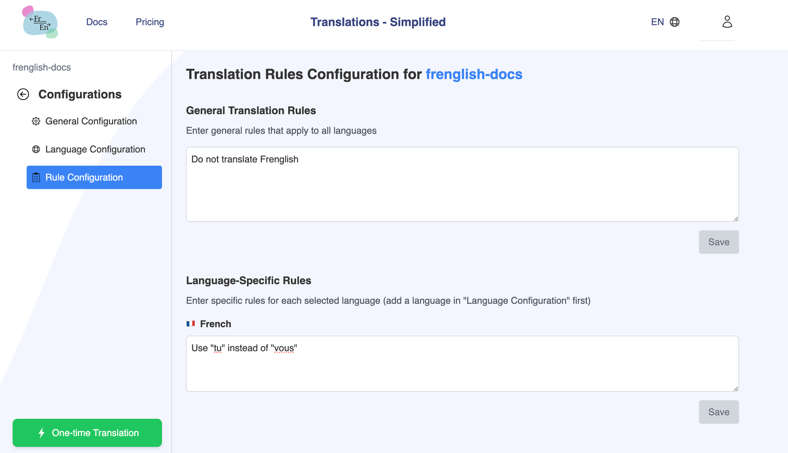

## Manage translation settings on the Frenglish.ai website

In the "General Configuration" tab, 
    a. Turn on the "Repository Active Status" and click "Save"
    b. Enter the translation path (ex "src/locales/*" ) you would like the files to manage translations for (all files under that path will be translated), click "Add path" then click "Save".


In the "Language Configuration" tab,
    a. Select your origin language (files you regularly manage, ex. English), then click "Save"
    b. Select languages you want to support, then click "Save"


Optionally, in the "Rules Configuration" tab,
    a. Enter all the general rules all your translation files should follow, then click "Save"
    b. Enter language specific rules for yoru translation files, then click "Save"



### Terrminology

**Origin Language**: The origin language of your document/webpage. This is the language that you will regularly update to add new content.

**Target Languages**: All the languages you want to support

**Rules**: All the translation rules you want to be applied during translation.

**Translation Paths**: All the paths you want the Frenglish bot to parse through to translate the files in that directory. Can also have path to specific files.

**Auto-Merge**: Option to auto-merge the new translation files by Frenglish into your branch. Otherwise, a Pull Request will be created on a new branch based on the branch where you edited a file that needs translation

**Rules per language**: Allows you to specify language specific rules for all the languages you want to support

## Manage translation settings in your repository
You can also manage your Frenglish configuration locally via a config json file.

1. Install the Frenglish bot for your selected repositories you want to apply translations to
2. Create a `frenglishConfig.json` in your root directory (copy sample below)
3. Configure all translation settings inside the json:

```json
{
    "originLanguage": "en",
    "languages": ["fr"],
    "rules": "Do not translate Frenglish",
    "translationPaths": ["docs/locales/*"],
    "autoMergeToBaseBranch": false,
    "rulesPerLanguage": [
      {
         "language": "fr",
         "rules": "French rule 1. French rule 2"
      },
     ],
    "useThisConfig": true
}
```

**originLanguage**: Specify the origin language of your document/webpage. This is the language that you will regularly update to add new content.

**languages**: Specify all the languages you want to support in a string array.

**rules**: In a string, specify all the translation rules you want. These rules will be applied to all translation files.

**translationPaths**: Specify all the paths you want the Frenglish bot to parse through to translate all the files in that directory.

**autoMergeToBaseBranch**: Boolean option - **False** will create a Pull Request on a new branch based on the branch where you edited an origin language translation file. **True** will auto-merge the new translation files into your branch.

**rulesPerLanguage**: Allows you to specify language specific rules for all the languages you want to support

**useThisConfig**: Since we offer the option to configure your translation on www.frenglish.ai, setting this boolean will ensure you are using the json config instead of the one you created on the website. However, if we don't find a `frenglishConfig.json` in your root directory, we will utilize the translation settings you configured on the website. You could also set this to "false", so that we utilize the configuration on the website.