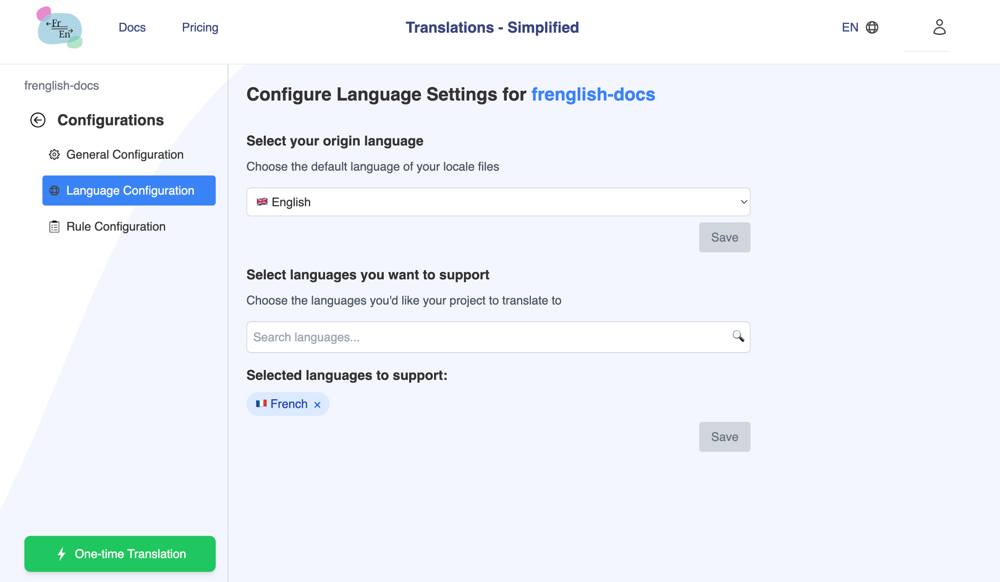
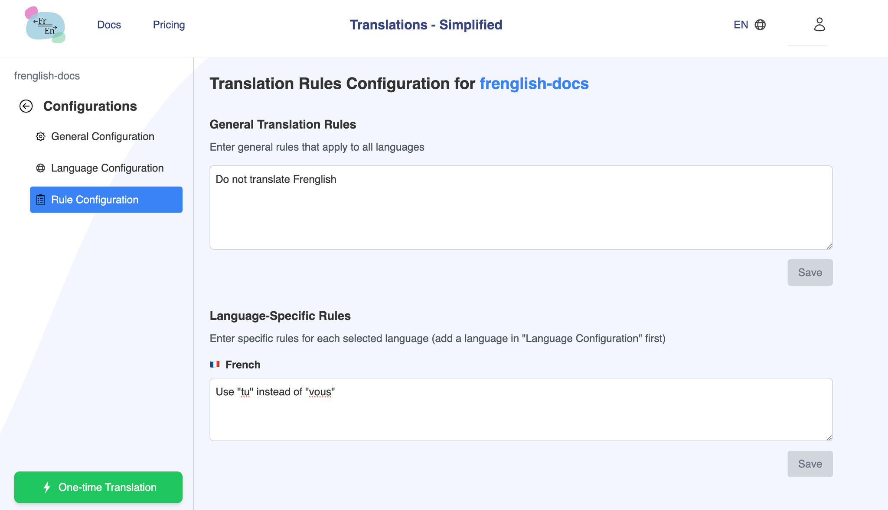

# General Configuration

## Manage translation settings on the Frenglish.ai website

In the "General Configuration" tab, 
    a. Turn on the "Project Active Status" and click "Save"
    b. Enter the translation path (ex "src/locales/*" ) you would like the files to manage translations for (all files under that path will be translated), click "Add path" then click "Save".

In the "Language Configuration" tab,
    a. Select your origin language (files you regularly manage, ex. English), then click "Save"
    b. Select languages you want to support, then click "Save"

Optionally, in the "Rules Configuration" tab,
    a. Enter all the general rules all your translation files should follow, then click "Save"
    b. Enter language specific rules for yoru translation files, then click "Save"

### Terrminology

**Origin Language**: The origin language of your document/webpage. This is the language that you will regularly update to add new content.

**Target Languages**: All the languages you want to support

**Rules**: All the translation rules you want to be applied during translation.
