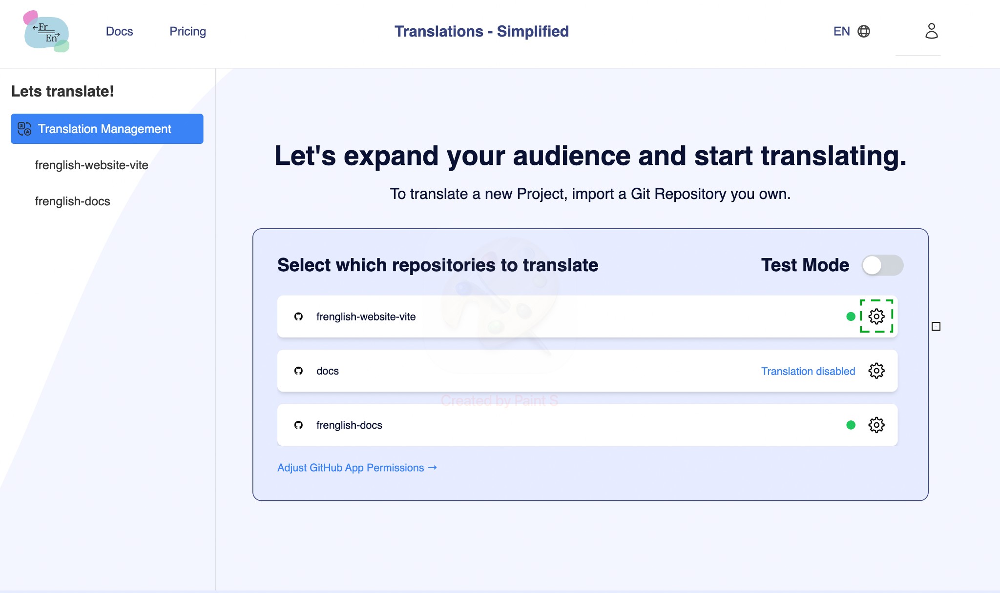
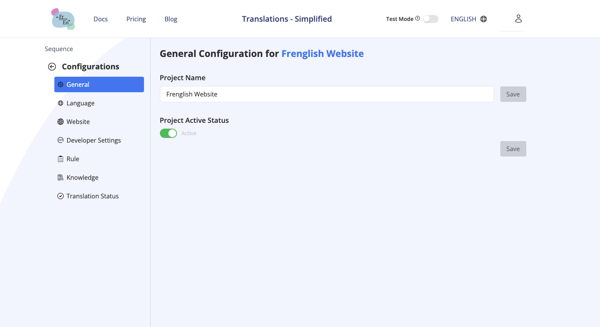
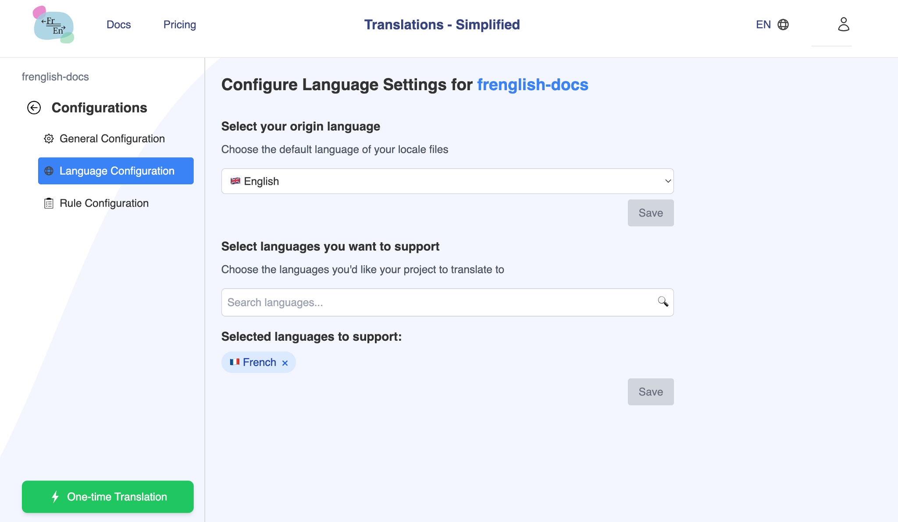

# Quickstart

**Integrated Translation Tool**
1. Click on your profile icon and click "Translate" (or go to http://frenglish.ai/translate)
2. Download the [Frenglish GitHub App](https://github.com/apps/frenglish-translation) and click **Install** on your Github repository.
3. Click on the Github repository's gear icon you would like to edit the settings for

4. In the "General Configuration" tab, 
    a. Turn on the "Repository Active Status" and click "Save"
    b. Enter the translation path (ex "src/locales/*" ) you would like the files to manage translations for (all files under that path will be translated), click "Add path" then click "Save".

   

    In the "Language Configuration" tab,
    a. Select your origin language (files you regularly manage, ex. English), then click "Save"
    b. Select languages you want to support, then click "Save"

   

5. You're ready to translate! Your next translation will be created on your next commit (for changes detected in your language files) or click the green "One-time Translation" to get started.