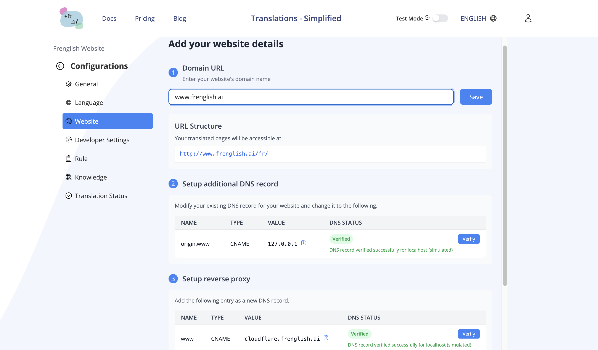

# Inicio rápido
Frenglish.ai ofrece traducción de sitios web en tiempo real a través de un sistema de proxy inverso. Cuando los visitantes acceden a tu sitio, nuestro worker de Cloudflare intercepta la solicitud, recupera tu contenido original, lo traduce y sirve la versión traducida en el idioma preferido del usuario.

## Configuración de la traducción del sitio web

1.  **Prepara tu proyecto**
    - Inicia sesión en tu panel de Frenglish.ai
    - Configura los idiomas de destino que desees
    - Activa tu proyecto
    - Navega a la pestaña Website

2.  **Registra tu dominio**
    - Agrega el dominio de tu sitio en la pestaña Website
    - Copia la configuración DNS proporcionada

3.  **Configura los ajustes de DNS**
    - Ve a la página de gestión de DNS de tu proveedor de dominio
    - Sigue las instrucciones que aparecen en la página de configuración de tu proyecto en Frenglish

## Prueba sin un dominio
Si quieres probar la función de traducción sin configurar el DNS, puedes añadir nuestro fragmento de JavaScript al body de tu sitio web:

```html
<script src="https://frenglish.ai/frenglish.bundle.js" strategy="beforeInteractive"></script>
<script id="frenglish-init" strategy="afterInteractive">
   window.frenglishSettings = {
      api_key: "your-public-api-key",
   };
   if (window.Frenglish) {
      window.Frenglish.initialize(window.frenglishSettings);
   }
</script>
```

## Cómo funciona

1. Cuando un usuario visita tu sitio web, nuestro sistema detecta su idioma preferido
2. La solicitud se enruta a través de nuestro worker de Cloudflare
3. El worker obtiene tu contenido original
4. El contenido se traduce automáticamente al idioma preferido del usuario
5. La versión traducida se muestra al usuario

Tus páginas traducidas estarán disponibles en URLs específicas por idioma:
- Original: `example.com/`
- Francés: `example.com/fr/`
- Español: `example.com/es/`
- (Idiomas adicionales según lo configurado en tu proyecto)

## Ventajas de este enfoque

- La configuración toma solo unos minutos, sin necesidad de cambiar tu código
- Traducción en tiempo real sin mantener versiones separadas por idioma
- Detección y enrutamiento automático de idioma
- No necesitas modificar la estructura de tu sitio web
- URLs amigables para SEO para cada idioma
- Esta traducción del lado del servidor es imprescindible para un buen SEO localizado

## Ventajas SEO
Nuestro sistema de traducción está diseñado para maximizar la visibilidad de tu sitio en buscadores en diferentes idiomas y regiones:
1.  **URLs localizadas**
    - Cada versión de idioma tiene su propia estructura de URL (por ejemplo, `example.com/fr/`, `example.com/es/`)
    - Los motores de búsqueda reconocen estas como versiones localizadas y distintas de tu contenido

2.  **Etiquetas HTML de idioma correctas**
    - Actualizamos automáticamente el atributo `<html lang="...">` para cada idioma
    - Se agregan meta etiquetas específicas de idioma para ayudar a los motores de búsqueda a entender el idioma del contenido

3.  **Implementación de Hreflang**
    - Adición automática de etiquetas `<link rel="alternate" hreflang="...">`
    - Ayuda a los motores de búsqueda a entender la relación entre tus páginas traducidas
    - Asegura que la versión correcta en el idioma adecuado se muestre en los resultados de búsqueda según la ubicación y preferencias del usuario

4.  **Localización de contenido**
    - Todo el contenido se traduce correctamente, incluyendo títulos, descripciones y palabras clave meta
    - Ayuda a mejorar el posicionamiento en los resultados de búsqueda locales para cada idioma objetivo
    - Mantiene el valor SEO en todas las versiones de idioma

5.  **Traducción del lado del servidor**
    - El contenido se traduce antes de llegar al cliente
    - Los rastreadores SEO reciben el contenido traducido de inmediato, permitiendo que lo indexen

Estas optimizaciones ayudan a los motores de búsqueda a indexar correctamente tu contenido multilingüe, lo que puede mejorar tu posicionamiento en búsquedas locales y ampliar tu alcance internacional.