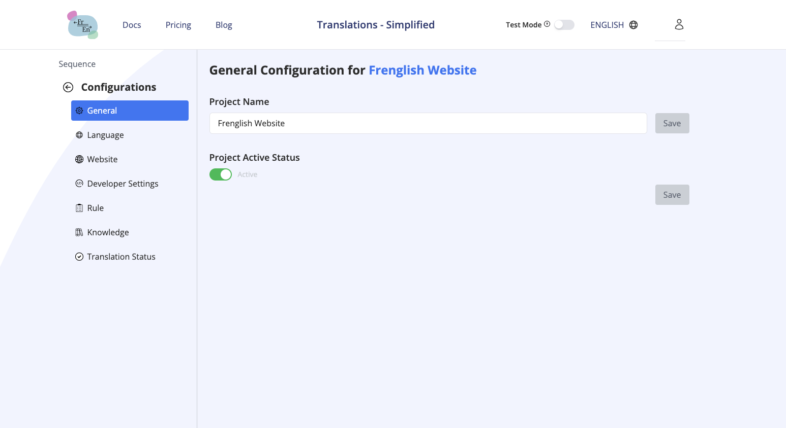

# Configuration générale

## Gère les paramètres de traduction sur le site Frenglish.ai
Dans l’onglet « Configuration générale » :
a. Active le « Statut actif du projet » et clique sur « Enregistrer »
b. Entre le chemin de traduction (ex : « src/locales/\* ») pour lequel tu veux gérer les traductions (tous les fichiers sous ce chemin seront traduits), clique sur « Ajouter un chemin » puis sur « Enregistrer ».

Dans l’onglet « Configuration des langues » :
a. Sélectionne ta langue d’origine (celle que tu utilises habituellement, ex : anglais), puis clique sur « Enregistrer »
b. Sélectionne les langues que tu veux prendre en charge, puis clique sur « Enregistrer »

Optionnellement, dans l’onglet « Configuration des règles » :
a. Entre toutes les règles générales que tes fichiers de traduction doivent suivre, puis clique sur « Enregistrer »
b. Ajoute des règles spécifiques à chaque langue si besoin, puis clique sur « Enregistrer »

### Terminologie
**Langue d’origine** : La langue principale de ton document ou site web. C’est celle que tu mets à jour régulièrement pour ajouter du contenu.

**Langues cibles** : Toutes les langues que tu veux offrir

**Règles** : Toutes les règles de traduction que tu veux appliquer pendant la traduction.