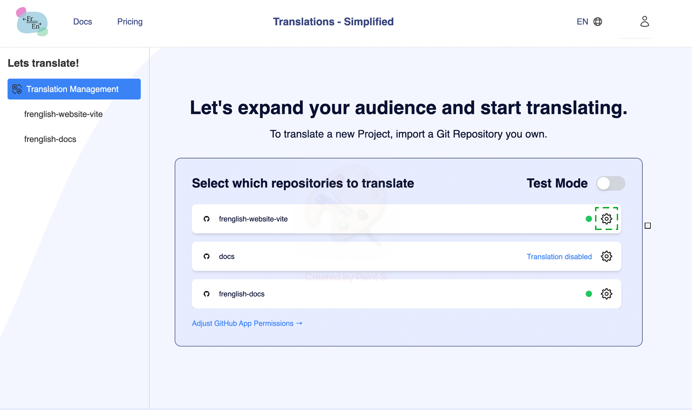

fr + fr-translated # Démarrage rapide

fr + fr-translated **Outil de traduction intégré**
1. Cliquez sur votre icône de profil et cliquez sur "Traduire" (ou allez sur http://frenglish.ai/translate)
2. Téléchargez l'[application Frenglish GitHub](https://github.com/apps/frenglish-translation) et cliquez sur **Installer** sur votre dépôt Github.
3. Cliquez sur l'icône d'engrenage du dépôt Github pour lequel vous souhaitez modifier les paramètres

fr + fr-translated 

fr + fr-translated 4. Dans l'onglet "Configuration générale", 
    a. Activez le "statut actif du dépôt" et cliquez sur "Enregistrer"
    b. Entrez le chemin de traduction (ex "src/locales/*" ) pour lequel vous souhaitez gérer les traductions (tous les fichiers sous ce chemin seront traduits), cliquez sur "Ajouter un chemin" puis cliquez sur "Enregistrer".

fr + fr-translated 

fr + fr-translated Dans l'onglet "Configuration des langues",
    a. Sélectionnez votre langue d'origine (les fichiers que vous gérez régulièrement, ex. Anglais), puis cliquez sur "Enregistrer"
    b. Sélectionnez les langues que vous souhaitez prendre en charge, puis cliquez sur "Enregistrer"

fr + fr-translated 

fr + fr-translated 5. Vous êtes prêt à traduire ! Votre prochaine traduction sera créée lors de votre prochain commit (pour les modifications détectées dans vos fichiers de langue) ou cliquez sur le bouton vert "Traduction unique" pour commencer.