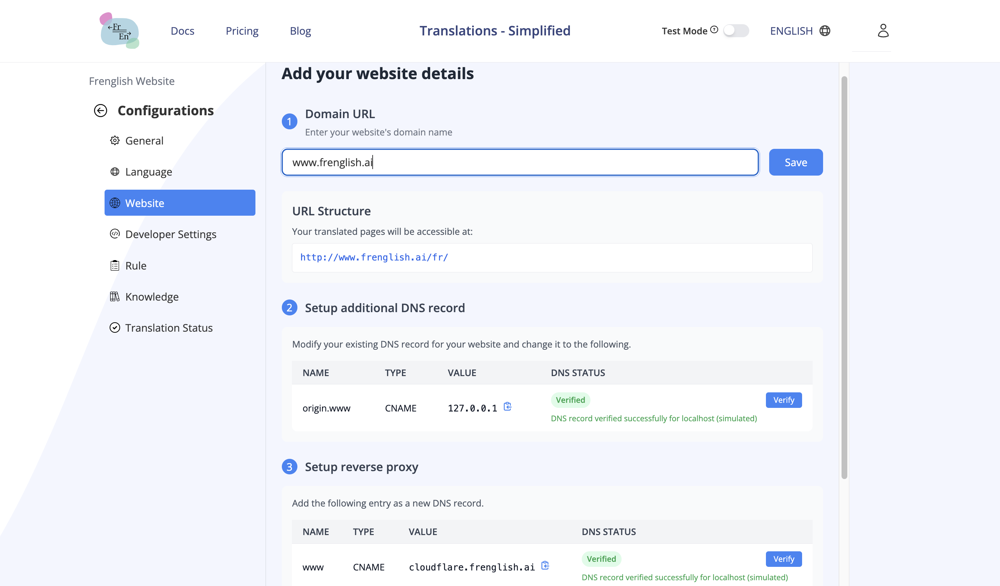

# クイックスタート
Frenglish.aiはリバースプロキシシステムを使ってリアルタイムでウェブサイトを翻訳します。訪問者があなたのサイトにアクセスすると、Cloudflareワーカーがリクエストを受け取り、元のコンテンツを取得して翻訳し、ユーザーの希望言語で表示します。

## ウェブサイト翻訳の設定方法

1.  **プロジェクトの準備**
    - Frenglish.aiのダッシュボードにログイン
    - 希望するターゲット言語を設定
    - プロジェクトを有効化
    - 「ウェブサイト」タブに移動

2.  **ドメインの登録**
    - 「ウェブサイト」タブで自分のウェブサイトドメインを追加
    - 表示されるDNS設定をコピー

3.  **DNS設定の構成**
    - ドメインプロバイダーのDNS管理ページにアクセス
    - Frenglishのプロジェクトウェブサイト設定ページに表示されている手順に従う

## ドメインを設定せずにテストする方法
DNS設定をせずに翻訳機能を試したい場合は、以下のJavaScriptスニペットをウェブサイトのbodyに追加してください：

```html
<script src="https://frenglish.ai/frenglish.bundle.js" strategy="beforeInteractive"></script>
<script id="frenglish-init" strategy="afterInteractive">
   window.frenglishSettings = {
      api_key: "your-public-api-key",
   };
   if (window.Frenglish) {
      window.Frenglish.initialize(window.frenglishSettings);
   }
</script>
```

## 仕組み

1. ユーザーがあなたのサイトを訪れると、システムがそのユーザーの希望言語を検出します
2. リクエストはCloudflareワーカー経由でルーティングされます
3. ワーカーが元のコンテンツを取得します
4. コンテンツが自動的にユーザーの希望言語に翻訳されます
5. 翻訳されたバージョンがユーザーに表示されます

翻訳ページは言語ごとのURLでアクセスできます：
- オリジナル: `example.com/`
- フランス語: `example.com/fr/`
- スペイン語: `example.com/es/`
- （プロジェクトで設定した追加言語も同様）

## この方法のメリット

- 数分でセットアップでき、コードの変更は不要
- 別々の言語バージョンを管理せずにリアルタイム翻訳が可能
- 自動で言語検出＆ルーティング
- 既存のウェブサイト構造を変更する必要なし
- 各言語ごとにSEOに適したURLを自動生成
- このサーバーサイド翻訳は、ローカライズSEOに必須です

## SEOのメリット
当社の翻訳システムは、多言語・多地域での検索エンジンでの可視性を最大化するよう設計されています：
1.  **ローカライズURL**
    - 各言語バージョンごとに独自のURL構造（例：`example.com/fr/`, `example.com/es/`）を持ちます
    - 検索エンジンはこれらを別々のローカライズされたコンテンツとして認識します

2.  **正しいHTML言語タグ**
    - 各言語ごとに`<html lang="...">`属性を自動で更新します
    - 言語ごとのmetaタグも追加し、検索エンジンがコンテンツの言語を理解しやすくします

3.  **Hreflangの実装**
    - `<link rel="alternate" hreflang="...">`タグを自動で追加します
    - 検索エンジンに翻訳ページ同士の関係性を伝えます
    - ユーザーの地域や言語設定に応じて、正しい言語バージョンが検索結果に表示されます

4.  **コンテンツのローカライズ**
    - metaタイトル、説明、キーワードなども含め、すべてのコンテンツを正しく翻訳します
    - 各ターゲット言語でのローカル検索順位向上に役立ちます
    - 全言語バージョンでSEO価値を維持します

5.  **サーバーサイド翻訳**
    - コンテンツはクライアントに届く前に翻訳されます
    - SEOクローラーは翻訳済みコンテンツを即座に取得でき、インデックスされやすくなります

これらの最適化により、多言語コンテンツが正しく検索エンジンにインデックスされ、ローカル検索順位の向上や国際的なリーチ拡大が期待できます。