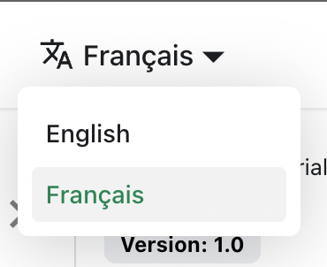

# Перевод docusaurus

Для примера, как структурировать i18n с Docusaurus, посмотрите [документы Frenglish](https://github.com/viv-cheung/frenglish-docs).

В противном случае, давайте переведем `docs/intro.md` на французский.

## Настройка i18n

Измените `docusaurus.config.js`, чтобы добавить поддержку файла перевода `fr`:

```js title="docusaurus.config.js"
export default {
  i18n: {
    defaultLocale: 'en',
    locales: ['en', 'fr'],
  },
};
```

## Перевод документа

Скопируйте файл `docs/intro.md` в папку `i18n/fr`:

```bash
mkdir -p i18n/fr/docusaurus-plugin-content-docs/current/

cp docs/intro.md i18n/fr/docusaurus-plugin-content-docs/current/intro.md
```

Переведите `i18n/fr/docusaurus-plugin-content-docs/current/intro.md` на французский.

## Запуск локализованного сайта

Запустите ваш сайт на французском файле перевода:

```bash
npm run start -- --locale fr
```

Ваш локализованный сайт доступен по адресу [http://localhost:3000/fr/](http://localhost:3000/fr/) и страница `Getting Started` переведена.

:::caution

В разработке вы можете использовать только один язык одновременно.

:::

## Добавить выпадающее меню локали

Чтобы беспрепятственно перемещаться между языками, добавьте выпадающее меню локали.

Измените файл `docusaurus.config.js`:

```js title="docusaurus.config.js"
export default {
  themeConfig: {
    navbar: {
      items: [
        // highlight-start
        {
          type: 'localeDropdown',
        },
        // highlight-end
      ],
    },
  },
};
```

Теперь выпадающее меню локали появляется в вашей навигационной панели:



## Построение локализованного сайта

Постройте ваш сайт для конкретной локали:

```bash
npm run build -- --locale fr
```

Или постройте ваш сайт, чтобы включить все локали сразу:

```bash
npm run build
```